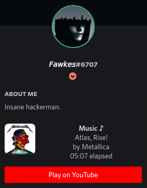

# cmus-discord-rpc

This script implements a discord rich presence for cmus.
This was honestly developed for my very personal use case (i.e. download using youtube-dl which embeds YT urls in the files metadata).
If you can make any use of this, great. If not, you could always try to contact me to question me about this script.

## Preview:

